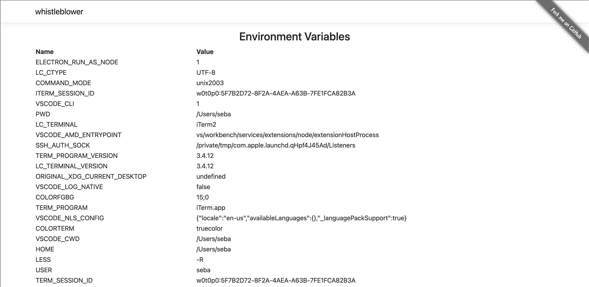

[](https://github.com/sebagomez/whistleblower/actions/workflows/dotnet-build.yaml)
[](https://github.com/sebagomez/whistleblower/actions/workflows/docker-build-push.yaml)

# whistleblower

List all of your local environment variables.



This simple web app is useful (for me) for testing purposed to easily check if the Pods of a cluster contain the right environment variables.

You DO NOT want this web app in a production environment.

## Execution

Just run the docker container with the following command

```sh
docker run -it --rm -p 8080:80 sebagomez/whistleblower
```

and then go to [http://localhost:8080](http://localhost:8080) to see the variables.

